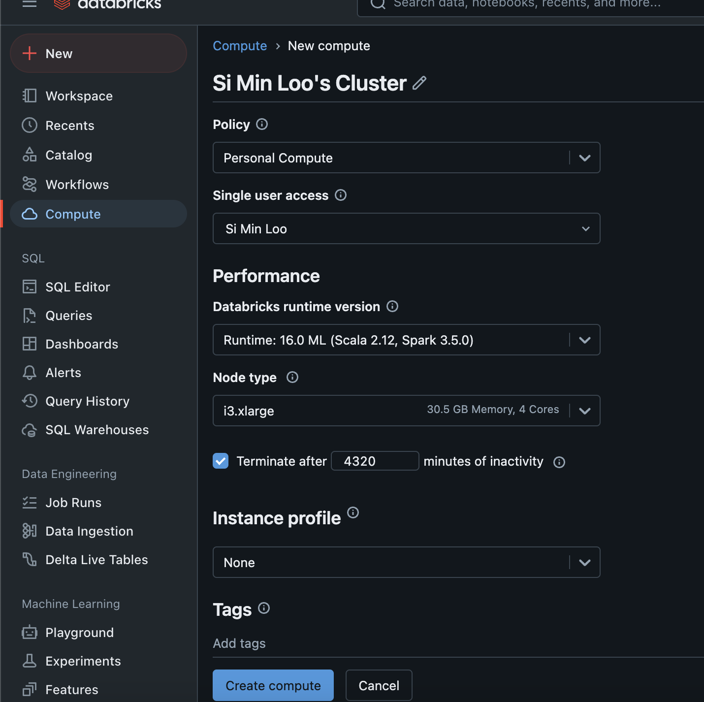
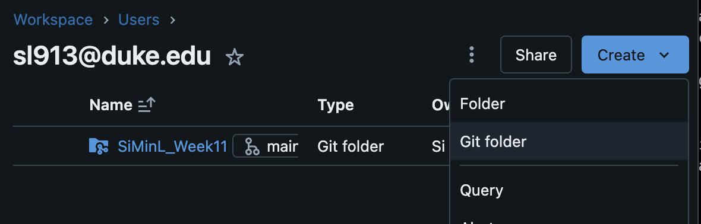
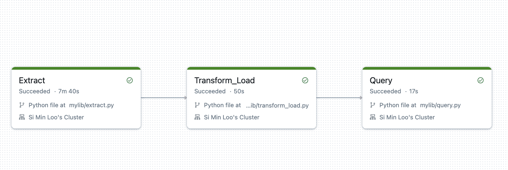

# SiMinL_MiniProj11

# Requirements
Create a data pipeline using Databricks
Include at least one data source and one data sink
Databricks notebook or script
Document or video demonstrating the pipeline

# Purpose 
Overview: This repository provides an ETL pipeline using PySpark within Databricks to extract data from an external source, transform it for analysis, and load it into a Databricks Delta table.

# Components
1. Create the Cluster

2. Import Github repo to Databricks

3. Configure environment in Github and Databricks Cluster
4. Create jobs and link them to Github repo
5. Run the job Perform ETL

